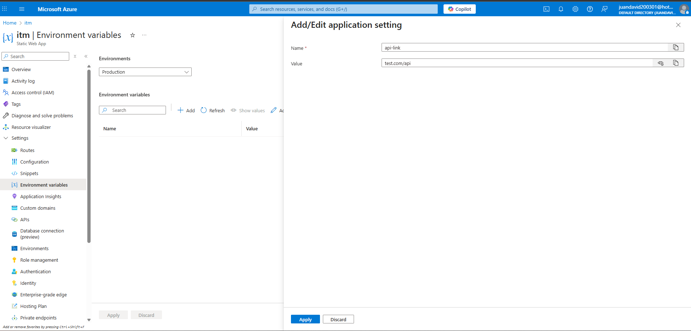

# CommITM3
Evento Evaluativo 3 / Despliegue en IIS y Nube Azure

## Integrantes

- Juan David Gaviria
- Ana María Valencia Quintero
- Fabian Rios Ferrer
- Johan Sneider Garzon Salazar
- Juan David Osorio Zapata

## Enlaces Videos

[Video Explicacion](https://drive.google.com/file/d/19X7N8V0kAYWTLVuR9iJDIcAbGkfnVBGm/view?usp=sharing)

[Sitio Desplegado En Azure](https://blue-sky-06edd5910.3.azurestaticapps.net/)

## Evidencias IIS

### Creacion App Pool 

### Configuracion Del Sitio 

### Prueba Del Navegador

### Health

## Evidencias Azure

> [!NOTE]
> Publicamos como Static Web App, por lo que Https Only esta activado por defecto.

### Variables Entorno

### Sitio Desplegado

## Adicionales

## Fechas De Publicacion

Primer punto: 18/10/2025
Segundo punto: 